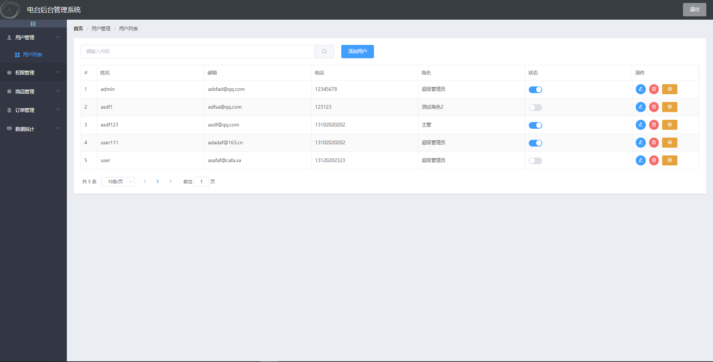
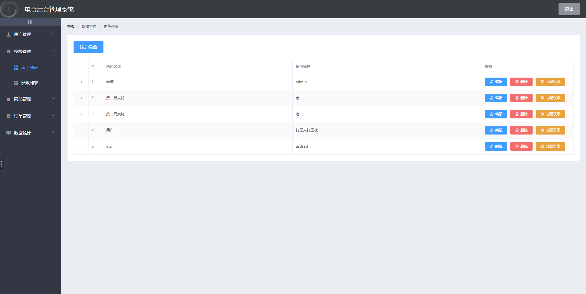

# vueshop


 
 

## Project setup

```
npm install
```

### Compiles and hot-reloads for development

```
npm serve
```

### Compiles and minifies for production

```
npm build
```

### Lints and fixes files

```
npm lint
```

### Customize configuration

See [Configuration Reference](https://cli.vuejs.org/config/).
